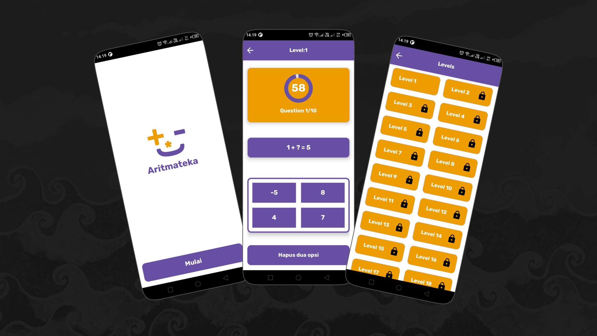

# Aritmateka a Math Quiz App Android Studio Kotlin

Welcome to the Aritmateka development tutorial series! In this series, we'll guide you through the process of creating a Aritmateka using Android Studio and Kotlin. Each part of the series covers a specific aspect of app development.

## Overview

Building a Aritmateka can be both fun and educational. This series is designed to help you grasp fundamental concepts in Android development while creating an engaging and interactive application. The videos are structured to take you through the entire development lifecycle, from designing screens to implementing advanced features like encryption and API key security.

## Getting Started

Make sure to follow the videos in order for a seamless learning experience. Each video builds on the previous one, helping you understand the complete app development process.

## Screenshots

Your generosity is greatly appreciated! Thank you for supporting this project.

Happy coding!
